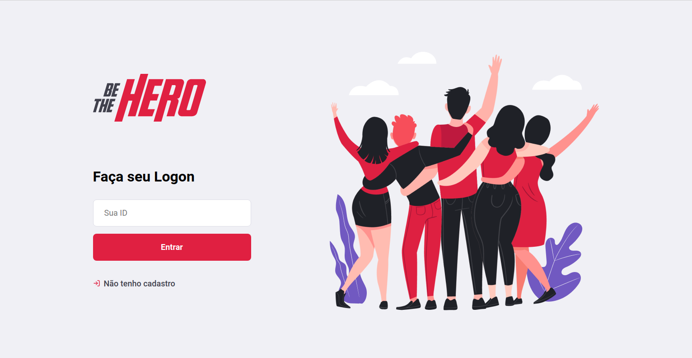
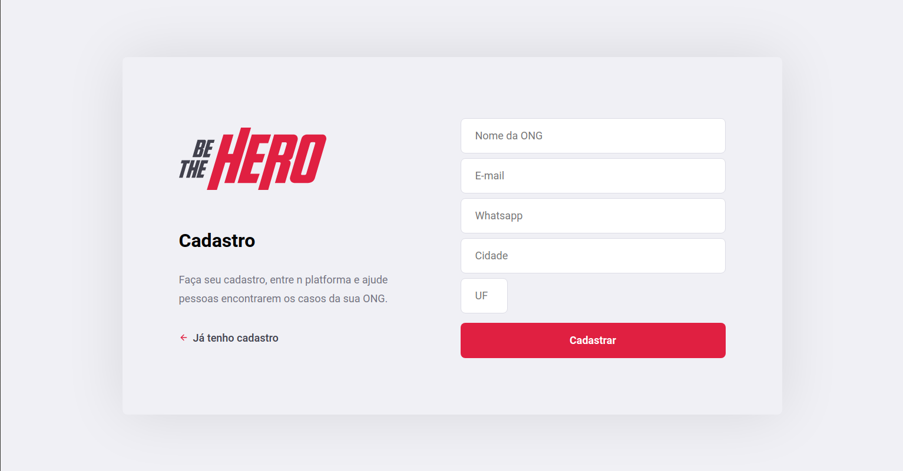
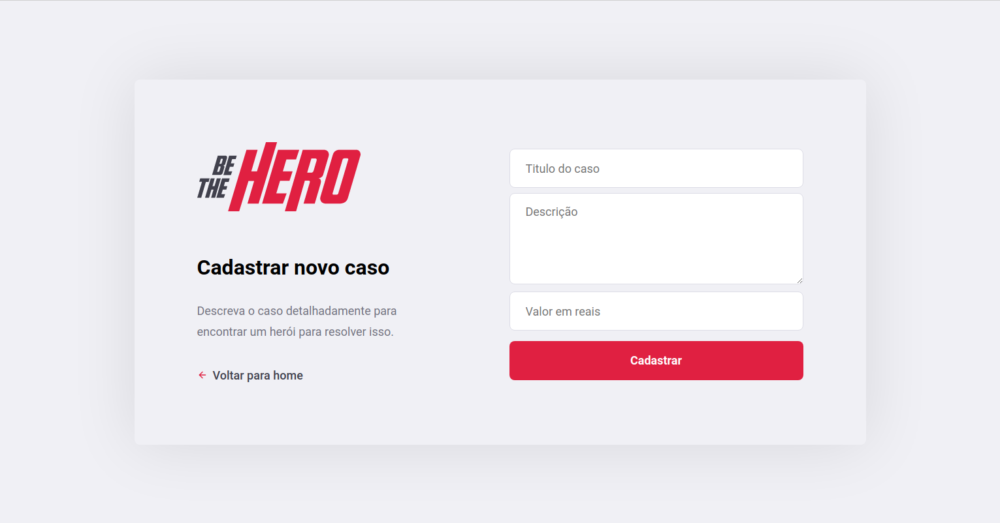
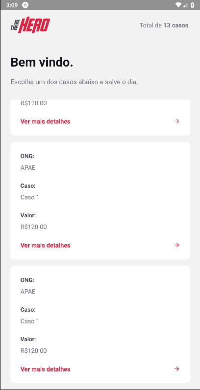
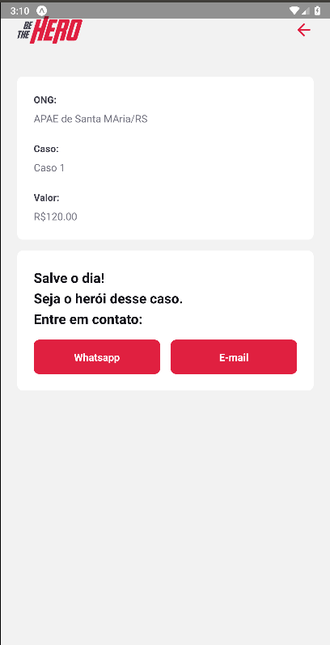

<h1 align="center">
    
</h1>

<h2 align="center">
   
💜 BE THE HERO 🚀

</h2>

  

  

  

  <a href="#projeto">Projeto</a>&nbsp;&nbsp;&nbsp;|&nbsp;&nbsp;&nbsp;
  <a href="#protótipos">Protótipos</a>&nbsp;&nbsp;&nbsp;|&nbsp;&nbsp;&nbsp;
  <a href="#tecnologias">Tecnologias</a>&nbsp;&nbsp;&nbsp;
  

## Projeto:

O projeto foi desenvolvido durante a Semana Omnistack 11 ministrada pela Rockseat. Consiste em uma aplicação na qual a parte web é voltada para Ongs adicionar caso que necessitam de um herói. Já na versão mobile heróis pedem ver os casos listados, obter um detalhamento e ter acesso a formas de como contatar a ong para ajudar. 

## Protótipos:

> Web:

    
    
    

> Mobile:

    
    
    

## Tecnologias
- REACT
- REACT NATIVE
- NODEJS
- EXPO

